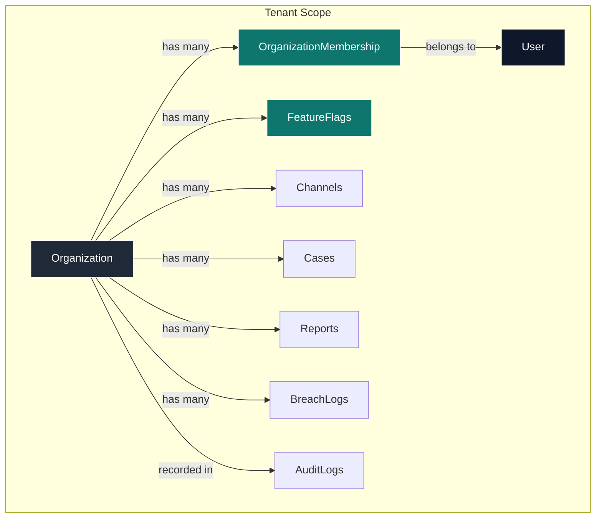
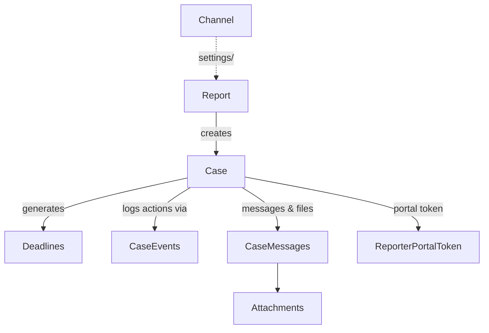
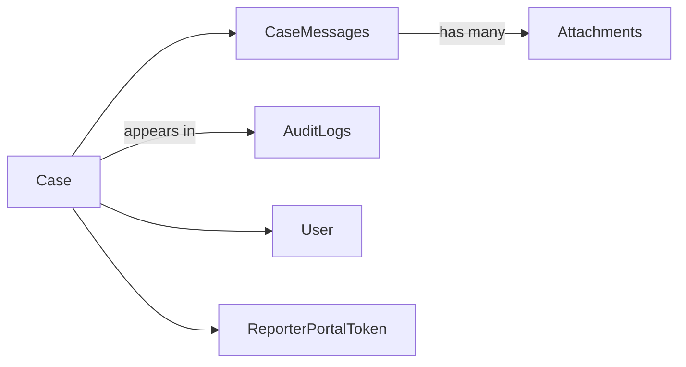
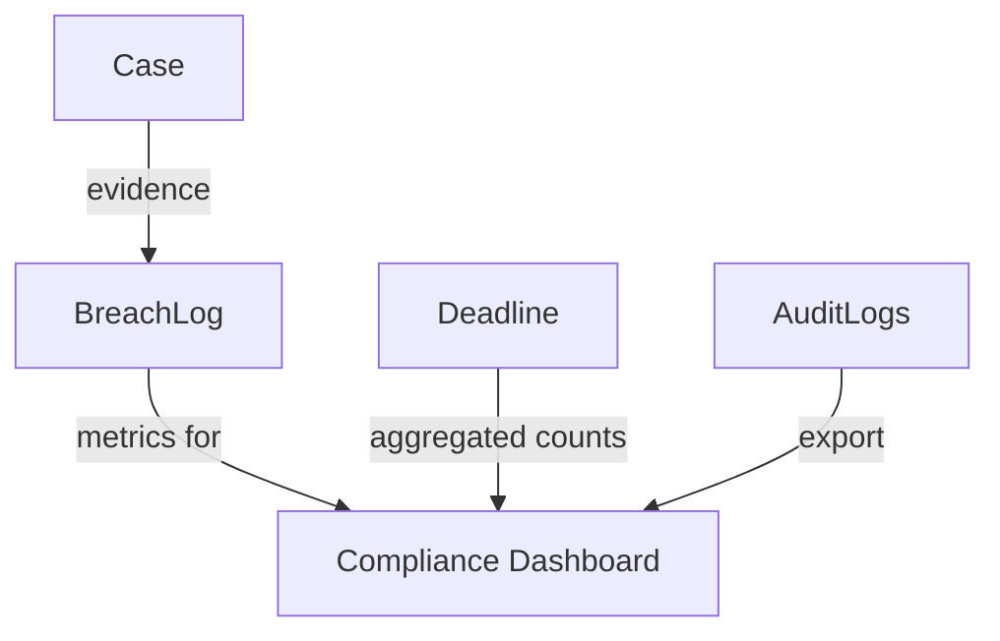
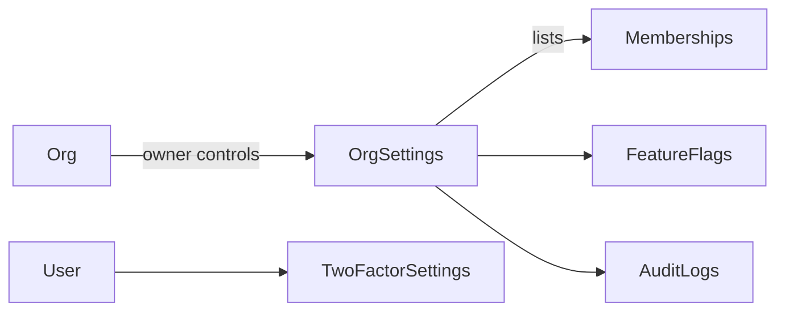
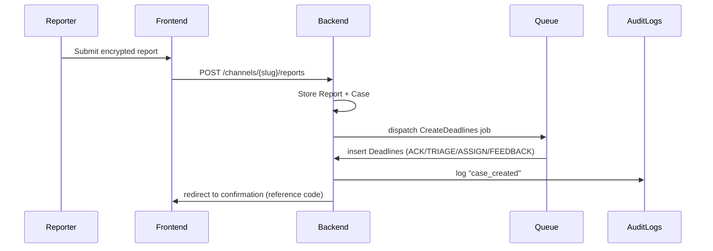

# Process Mapping & Business Logic

The diagrams below summarize how the major models interact, what triggers create downstream effects, and which business rules apply. Each Mermaid graph captures a core domain slice so you can visualize the flow when reading controllers or designing new features.

---

## 1. Organization & Tenancy

**Business Notes**
- Membership roles (`OrgRole`) gate access; middleware loads `tenant` + membership.
- Feature flags combine persisted toggles with manifest JSON per organization.
- Every tenant-specific model must include `organization_id` and preferably use `ScopedByOrganization`.

---

## 2. Channel → Report → Case Flow

**Business Notes**
- When a report is submitted, controllers encrypt payloads client-side; server stores ciphertext only.
- A new case is created for each report (1:1 now, but future merges/splits possible).
- Deadlines (ACK/TRIAGE/ASSIGN/FEEDBACK) created automatically; scheduler updates status and triggers notifications.
- Case events and audit logs track history; both must exclude sensitive ciphertext.

---

## 3. Case Detail Messaging & Attachments

**Business Notes**
- Messages have `sender_type` (agent/reporter/system). Reporter messages still encrypted end-to-end.
- Attachments are stored in S3-compatible storage; metadata includes checksum and encrypted meta info.
- Audit logs capture status changes, assignment updates, portal actions.
- Portal tokens allow reporters anonymous follow-up; tokens expire or can be revoked by agents.

---

## 4. Compliance & Breach Management

**Business Notes**
- Breach logs record incidents (GDPR Art.33); can link back to cases as evidence.
- Compliance overview aggregates open cases, breach counts, deadline status, and latest audit entries.
- Feature flag `compliance` guards access to breach and audit screens.

---

## 5. Settings & Administration

**Business Notes**
- Member management: owners/admins can invite users, change roles, disable access.
- Feature toggles combine JSON manifest + DB flags; owners can enable trials or view expiring features.
- Audit log page provides filters/export for regulators.
- Profile and 2FA settings rely on Fortify; permission checks ensure users confirm password before enabling 2FA.

---

## 6. Notification & SLA Processes

**Business Notes**
- Queue ensures SLA deadlines and notifications run asynchronously.
- Audit logging centralizes state changes; controllers use `AuditLogger::log` after mutations.
- When deadlines near breach, scheduled jobs send notifications (email/web) without exposing ciphertext.

---

## Using These Diagrams

1. **Trace flow** when adding features: e.g., to add SMS notifications, extend the Deadline branch in the notification sequence.
2. **Check relationships** before writing queries—each arrow hints at required eager loads.
3. **Consult business rules** (notes under each diagram) to ensure new code respects encryption, auditing, and multi-tenancy constraints.
